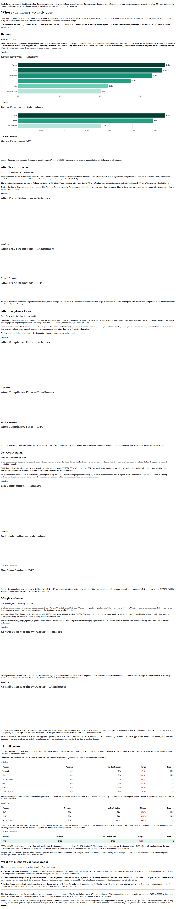

# Channel Profitability Analysis

Channel-by-channel profitability analysis showing where a specialty food brand actually makes — and loses — money after every cost is counted.

**Live:** https://channels.lailarallc.com



## What it does

An interactive analytical narrative for Cinderhaven, a fictional specialty food brand invoicing ~$25.3M in FY2025 ($76.4M cumulative invoiced, 2023–2025). It examines contribution margin across all 10 of the brand's sales channels — 6 contracted retailers (Walmart, Costco, Whole Foods, Sprouts, Kroger, Regional Group), 3 distributors (UNFI, KeHE, DPI Northwest), and Shopify DTC — through a five-layer cost waterfall: revenue, COGS, trade deductions, compliance fines, and operational overhead.

The result is a channel-level P&L a leadership team can act on: which channels earn their shelf space, which quietly erode margin, and where the next dollar of capital should go.

Part of the Cinderhaven portfolio — the first buyer-facing consumer of the Cinderhaven Data Platform. The dataset covers 50 SKUs across 5 product lines (Artisan Sauces, Pantry Staples, Specialty Condiments, Dried Goods, Snack Bites).

## Why it matters

Most mid-size CPG brands know their blended gross margin but not their margin by channel. Trade deductions and compliance fines land months after shipment and are rarely traced back to the channel that caused them, so "growth" channels can be net losers for years. Making all five cost layers visible per channel turns capital-allocation debates into arithmetic: expand where contribution margin is real, renegotiate or exit where it isn't.

Every number in the prose is validated against the underlying JSON data by automated checks, so the narrative cannot drift from the data.

## Quick start

```bash
npm install
npm run dev        # dev server at localhost:4321
npm run build      # production build to dist/
npm run deploy     # build + deploy to Cloudflare Pages (requires Wrangler auth)
```

Validation checks (Python):

```bash
python tests/test_prose_data.py    # prose claims vs JSON data
python scripts/verify_math.py      # layer consistency + cross-file checks
python scripts/verify_roi.py       # dispute overhead breakdown
```

## Data pipeline

Data flows from a Postgres database on Fly.io through embedded Python constants to JSON files consumed by the Astro site:

```
Postgres (SSOT) → scripts/generate_json.py → src/data/*.json → MDX → React/D3
```

```bash
python scripts/refresh_data.py     # refresh from DB (requires flyctl authenticated)
python scripts/generate_json.py    # regenerate JSON from snapshot constants (no DB needed)
```

## Tech stack

- **Framework:** Astro 5.9 (static site with React islands)
- **Charts:** D3 v7 + React 19
- **Content:** MDX narrative sections
- **Data pipeline:** Python script with embedded constants → JSON
- **Deployment:** Cloudflare Pages (via Wrangler)
- **Typography:** Self-hosted Playfair Display + Source Sans 3
- **Types:** TypeScript

## Project structure

```
scripts/            Python data pipeline + math verification
src/components/     React/D3 charts (waterfall, margin evolution, overhead scatter, ...)
src/content/        MDX narrative sections
src/data/           Generated JSON consumed by the site
tests/              Prose-vs-data validation checks
```

## License

MIT — see [LICENSE](LICENSE).

---
Built by [Lailara LLC](https://lailarallc.com) — data hygiene and analytics consulting for specialty food brands scaling into national retail.
